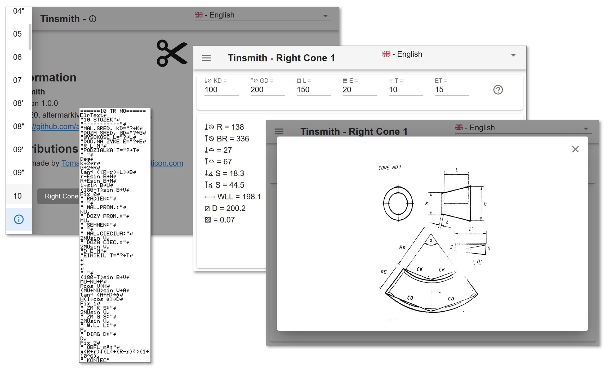

# Tinsmith

This code is based on a [old program](archive) found on a CASIO calculator and re-implemented as a [new web app](https://altermarkive.github.io/tinsmith/) with Go, TypeScript & Vue/Vuetify.

Dictionary:

* Angle: ∠
* Compass Opening: ∡
* Diameter: ⌀
* Radius: ⎋
* Circumference: ◯
* Maximum, Big(ger): ⤒
* Minimum, Small(er): ⤓
* Points: ⦙
* Segments: ┇
* Area: ▨
* Extra: ⬒
* Seam: ⬓
* Graduation: ⧻
* Size, Length, Spacing, Distance, Difference, Offset: ⟷
* Remainder: ⍆
* Height: ⍐
* Arc: ⌒
* Chord: ⌓
* Circular Sector: ◜
* Insulation: ⧚
* Parallel, Straight, Pipe: ∥
* Diagonal: ⧄
* Hole: ⚬
* Volume: ⟐
